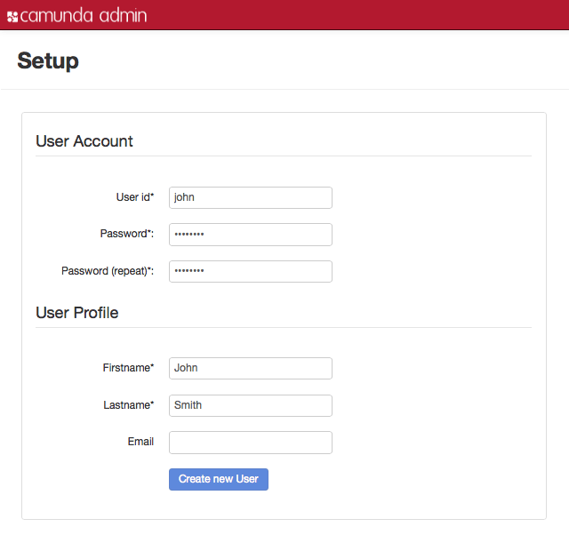
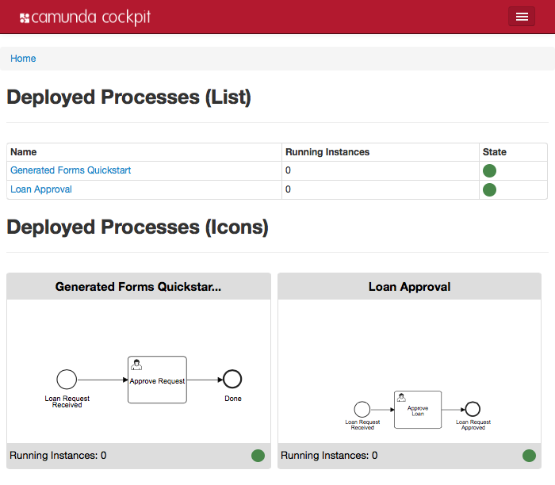
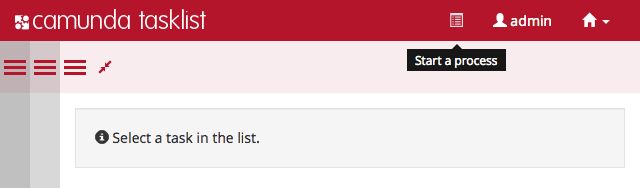
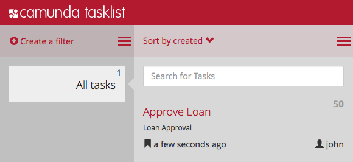
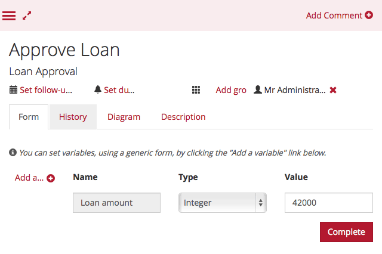

<p align="center">
    
    <h1 align="center">Camunda with Scala and Play Framework</h1>
</p>


<p align="center">
  <a href="#">
    
  </a>

  <a href="#">
    
  </a>

  <a href="#">
    
  </a>

  <a href="#">
    
  </a>

  <a href="#">
    
  </a>

  <a href="#">
    
  </a>
  
  <h3 align="center">Integrating Business Process Management with a web application</h3>
</p>

## Table of contents

This repository shows how to integrate [Camunda BPM](http://www.camunda.org) with a [Play Framework](http://playframework.com) web application.

- [Introduction](#introduction)
- [Installing the database and camunda BPM application](#installing-the-database-and-camunda-bpm-application)
- [Adding a Play framework application](#adding-a_play-framework-application)
- [Starting process instances](#starting-process-instances)
- [Next steps](#next-steps)
- [Bugs and feature requests](#bugs-and-feature-requests)
- [Contributing](#contributing)
- [Creator](#creator)
- [Copyright and license](#copyright-and-license)

## Introduction

The [camunda documentation](http://docs.camunda.org/latest/) includes a [tutorial for developing process applications](http://docs.camunda.org/latest/guides/getting-started-guides/developing-process-applications/) that shows how to install camunda BPM, build and deploy a simple process, and interact with the process using camunda’s [Cockpit](http://docs.camunda.org/latest/guides/user-guide/#cockpit) and [Tasklist](http://docs.camunda.org/latest/guides/user-guide/#tasklist) web applications. This tutorial uses the camunda BPM platform distribution that includes Apache Tomcat 7, runs on a local file-based H2 database, and shows a Java Servlet-based process application. Let’s consider an alternative architecture.

For this version of the tutorial, we are going to use a standalone distribution of the camunda web applications, embed the camunda BPM process engine in a Play/Scala web application, and use a shared PostgreSQL database for the two. This version of the tutorial has more configuration steps than the camunda version, but the end result is easier to understand if you are familiar with Play framework applications because nothing happens automatically.

## Installing the database and camunda BPM application

First, create a database and install the camunda BPM web application that you will use to interact with your deployed business processes. For this tutorial, you will need the following pre-requisites to start:

- Java Runtime Environment (JRE) 7
- [Apache Tomcat 7](http://tomcat.apache.org/)
- [PostgreSQL](http://www.postgresql.org/)

There are other Java versions, Java Servlet containers and SQL databases that work... see [Camunda’s supported environments](http://docs.camunda.org/latest/guides/user-guide/#introduction-supported-environments) for details.

## Create a database

First, install and start PostgreSQL (e.g. using [Homebrew](http://brew.sh/) with <code style="color: #c7254e;background-color: #f9f2f4;padding: 2px 4px;font-size: 90%;border-radius: 4px;">brew install postgres</code> on OS X). Open the PostgreSQL command line with (<code style="color: #c7254e;background-color: #f9f2f4;padding: 2px 4px;font-size: 90%;border-radius: 4px;">psql template1</code>) and use the following commands to create a user and database.

```sql
create database "process-engine";
create user camunda with password 'camunda';
grant all privileges on database "process-engine" to camunda;
```

## Install the camunda BPM web application

On the [camunda download page](http://camunda.org/download/), download the [camunda Standalone Webapp for Apache Tomcat 7](http://camunda.org/release/camunda-bpm/tomcat/7.2/camunda-webapp-tomcat-standalone-7.2.0.war).

Using your own Apache Tomcat installation location, deploy the WAR file - ‘exploded’ so we can edit the database configuration.

```shell
unzip camunda-webapp-tomcat-standalone-7.2.0.war -d /Applications/apache-tomcat-7.0.57/webapps/camunda/
```

Add the PostgreSQL JDBC driver to the camunda web application. If you don’t already have it, you can download the JAR from the corresponding [http://mvnrepository.com](http://mvnrepository.com/artifact/org.postgresql/postgresql/9.3-1102-jdbc41) artifact page or proceed with the next section until the Play application has downloaded the dependency to the local Ivy cache.

```shell
cp ~/.ivy2/cache/org.postgresql/postgresql/jars/postgresql-9.3-1102-jdbc41.jar /Applications/apache-tomcat-7.0.57/webapps/camunda/WEB-INF/lib/
```

## Configure the camunda BPM web application

Edit the deployed web application’s configuration, to change the <code>dataSource</code> bean to use the new PostgreSQL database by editing the four configuration property values:

```java
<bean id="dataSource" class="org.springframework.jdbc.datasource.TransactionAwareDataSourceProxy">
  <property name="targetDataSource">
    <bean class="org.apache.commons.dbcp.BasicDataSource">
      <property name="driverClassName" value="org.postgresql.Driver" />
      <property name="url" value="jdbc:postgresql://localhost/process-engine" />
      <property name="username" value="camunda" />
      <property name="password" value="camunda" />
    </bean>
  </property>
</bean>
```

Start Apache Tomcat to run the camunda BPM web application:

```shell
/Applications/apache-tomcat-7.0.57/bin/startup.sh
```

Open the camunda web application at <http://localhost:8080/camunda/> and create a new admin user with User ID ***admin***.

<p align="center">
    
</p>

Now you are ready to build your own process application and deploy a business process to the database.

## Adding a Play framework application

The next steps are to create a new [Play Framework](http://playframework.com) application, add a BPMN process definition and run the application to deploy the process definition to the database, so we can see it in the camunda BPM Cockpit application.

Create a new Play application
First, download Play framework 2.3 from the [Play framework download page](https://playframework.com/download). The default approach is to download Activator and use that to create a new Play application; alternatively, you can [add Play as a dependency to a new sbt project](https://playframework.com/documentation/2.3.x/NewApplication#Create-a-new-application-without-Activator).

Next create a new Play/Scala application, which we will use to deploy the business process. Using Activator:

```shell
activator new get-started-play play-scala
```

In the new application, edit <code>build.sbt</code> and replace the library dependencies section with the following, to add the database driver and camunda API:

```java
libraryDependencies ++= Seq(
  "org.postgresql" % "postgresql" % "9.3-1102-jdbc41",
  "org.camunda.bpm" % "camunda-bom" % "7.2.0",
  "org.camunda.bpm" % "camunda-engine" % "7.2.0")  
```

## Add the business process definition file

For this application, we can use the BPMN process definition from the original camunda BPM tutorial, which starts off as a trivial loan approval workflow with a single activity:

<p align="center">
    
</p>

Download [loan-approval.bpmn](https://github.com/camunda/camunda-get-started/raw/Step-3/src/main/resources/loan-approval.bpmn) from Step 3 of the [Developing Process Applications tutorial code](https://github.com/camunda/camunda-get-started/tree/Step-3) and add it to your application in <code>conf/loan-approval.bpmn</code> so it will be available on the application’s runtime classpath.

Next we need some code that will use the camunda BPM API to deploy <code>loan-approval.bpmn</code> to the process engine database.

## Integrate the application with the process engine

Add the following code in the new file <code>app/Global.scala</code>, to start the process engine and deploy the BPMN file when the Play application starts-up.

```scala
import org.camunda.bpm.engine.{ProcessEngineConfiguration, ProcessEngines}
import play.api.{Application, GlobalSettings, Logger}

object Global extends GlobalSettings {

  /**
   * Start the camunda BPM process engine and deploy process definitions on start-up.
   */
  override def onStart(application: Application): Unit = {
    val configuration = ProcessEngineConfiguration.createStandaloneProcessEngineConfiguration()
      .setJdbcDriver("org.postgresql.Driver")
      .setJdbcUrl("jdbc:postgresql://localhost/process-engine")
      .setJdbcUsername("camunda")
      .setJdbcPassword("camunda")
      .setDatabaseSchemaUpdate(ProcessEngineConfiguration.DB_SCHEMA_UPDATE_TRUE)
      .setHistory(ProcessEngineConfiguration.HISTORY_FULL)
      .setJobExecutorActivate(true)

    Logger.info("Starting process engine...")
    val engine = configuration.buildProcessEngine()

    Logger.info("Deploying process definition...")
    val deployment = engine.getRepositoryService.createDeployment()
    deployment.addClasspathResource("loan-approval.bpmn").enableDuplicateFiltering(true)
    deployment.deploy()
  }

  override def onStop(application: Application): Unit = {
    ProcessEngines.getDefaultProcessEngine.close()
  }
}
```

This code uses the camunda BPM API to configure the process engine programmatically. In a real application, you would externalise this to a configuration like the following in <code>conf/application.conf</code> and use the Play configuration API instead of hard-coding the values.

```scala
camunda {
  jdbcDriver = "org.postgresql.Driver"
  jdbcUrl = "jdbc:postgresql://localhost/process-engine"
  jdbcUsername = "camunda"
  jdbcPassword = "camunda"
  processDefinitions = ["loan-approval.bpmn", "new-account.bpmn"]
}
```

Anyway, for now, we have everything we need to run the Play application and deploy the business process.

## Deploying the business process

Now we are ready to use our new Play application to deploy our business process.

First log in to [Cockpit](localhost:8080/camunda/app/cockpit/) as the user that you created in the first section, above. The Cockpit dashboard shows *Deployed Processes*, which at this stage is only the sample *Generated Forms Quickstart* that the web application initially installs.

Now, in the Play application directory, start the Play application to deploy the loan approval process.

```shell
$ activator run
[info] Loading project definition from /camunda/get-started-play2/project
[info] Set current project to get-started-play2 (in build file:/camunda/get-started-play2/)
[info] Updating {file:/camunda/get-started-play2/}root...
[info] Resolving jline#jline;2.11 ...
[info] Done updating.

--- (Running the application, auto-reloading is enabled) ---

[info] play - Listening for HTTP on /0:0:0:0:0:0:0:0:9000

(Server started, use Ctrl+D to stop and go back to the console...)
```

The first time, this includes fetching the dependencies from Maven repositories. The application has not started yet, because this is lazy is dev mode. To compile and start the application, open <http://localhost:9000>, which makes the console show:

```shell
[info] Compiling 6 Scala sources and 1 Java source to /camunda/get-started-play2/target/scala-2.11/classes...
[info] application - Starting process engine...
[info] application - Deploying process definition...
[info] play - Application started (Dev)
```

The two lines starting <code>[info] application</code> are the application log output from our <code>Global.onStart</code> code.

Now reload the Cockpit dashboard page, which will now show the deployed loan approval process:

<p align="center">
    
</p>

Note that if starting the process engine fails with *ProcessEngineException: historyLevel mismatch* then you need to use a different history level in the call to <code>setHistory</code> in <code>Global.onStart</code>, such as <code>HISTORY_FULL</code>. The other values are listed in the [configuration properties reference](http://docs.camunda.org/latest/api-references/deployment-descriptors/#tags-process-engine-configuration-configuration-properties).

## Starting process instances

At this stage, we have deployed a process definition which means that we have defined a workflow that we can now execute in the process engine. We have described the process for approving a loan, but we don’t have any actual approvals to do yet. We need to be able to start a process instance based on this process definition.

## Using the camunda tasklist to start process instances

The simplest way to start a process is using the [camunda tasklist application](localhost:8080/camunda/app/tasklist/). Select the *Start a process* icon in the menu bar:

## Bugs and feature requests

Have a bug or a feature request? Please first read the [issue guidelines](https://github.com/allanavelar/camunda-scala-play/blob/master/contributing.md) and search for existing and closed issues. If your problem or idea is not addressed yet, [please open a new issue](https://github.com/allanavelar/camunda-scala-play/issues/new).

<p align="center">
    
</p>

On the *Start a process* dialog, select the *Loan Approval* process, then click *Start*.

The task list will initially be empty because there are no search filters. To create a filter:

- in the tasklist far-left column select Create a filter
- on the Create a filter dialog, in the Name field, enter All tasks
- click Save.

Now select the new filter in the first column, and the *Approve Loan* task will be listed in the second column.

<p align="center">
    
</p>

Although the camunda tasklist will be enough in some cases, you might want to integrate process instances with your application. You can either use the camunda REST API or the Java API.

## Starting process instances from a Play application

To be able to start process instances from our application, we will add a simple HTTP endpoint. Initially, this is like a simplified version of the camunda REST API, but demonstrates how to use the Java API.

First add a new HTTP route to the <code>conf/routes</code> file:

```shell
POST /loan-approval/:amount   controllers.Application.startLoanApprovalProcess(amount: Int)
```

This route defines an integer URL path parameter that we will pass to the process engine as a process variable. To do this, add the following action method to the <code>app/controllers/Application.scala</code> controller:

```scala
def startLoanApprovalProcess(loanAmount: Int) = Action {
  import org.camunda.bpm.engine.ProcessEngines
  import org.camunda.bpm.engine.variable.Variables._
  val runtime = ProcessEngines.getDefaultProcessEngine.getRuntimeService
  val processVariables = createVariables().putValueTyped("Loan amount", integerValue(loanAmount))
  val processInstance = runtime.startProcessInstanceByKey("approve-loan", processVariables)
  Created("started process instance " + processInstance.getId)
}
```

Now you can start the process instance with an HTTP request to the new endpoint:

```shell
$ curl --include --request POST "http://localhost:9000/loan-approval/42000"
HTTP/1.1 201 Created
Content-Type: text/plain; charset=utf-8
Content-Length: 28

started process instance 104
```

You can see this in the tasklist. Select the new *Approve Loan* process instance in the second column, on the right-hand side remove the *john* assignment and select *Claim* to assign the task you yourself. Now you can select *Load Variables* to show the process variable:

<p align="center">
    
</p>

## Next steps

The next step is [adding a service task](http://docs.camunda.org/latest/guides/getting-started-guides/developing-process-applications/#tutorial-add-a-service-task) from the original tutorial. The corresponding Scala code for the proces delegate is as follows:

```scala
package org.camunda.bpm.getstarted.loanapproval

import org.camunda.bpm.engine.delegate.{DelegateExecution, JavaDelegate}
import play.api.Logger

class ProcessRequestDelegate extends JavaDelegate {
  def execute(execution: DelegateExecution): Unit = {
    val amount = execution.getVariable("amount")
    Logger.info(s"Processing loan approval for amount $amount...")
  }
}
```

However, it is not possible to run this from the camunda Tasklist, as in the original tutorial, because our architecture is different. Our application is using a separate process engine to Tasklist, which therefore does not have access to the <code>ProcessRequestDelegate</code>. Instead, it is necessary to control the process from within our own application, using the camunda Java API. This is, of course, left as an exercise for the reader.

## Contributing

Please read through our [contributing guidelines](https://github.com/allanavelar/camunda-scala-play/blob/master/contributing.md). Included are directions for opening issues, coding standards, and notes on development.

Moreover, all HTML and CSS should conform to the [Code Guide](https://github.com/allanavelar/camunda-scala-play/blob/master/code-guide.md), maintained by [Main author](https://github.com/username).

Editor preferences are available in the [editor config](https://github.com/allanavelar/camunda-scala-play/blob/master/.editorconfig) for easy use in common text editors. Read more and download plugins at <https://editorconfig.org/>.

## Copyright and license

<a href="./license.md">
    
</a>
